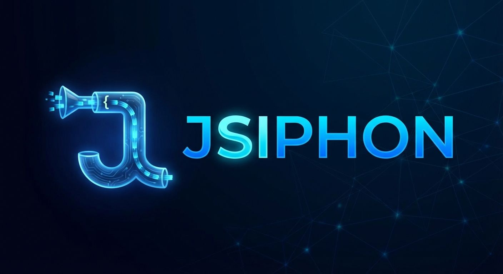
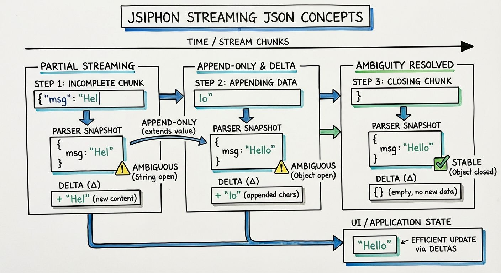

<p align="center">
  
</p>

# jsiphon

An append-only streaming JSON parser for TypeScript. Parse incomplete JSON as it streams in - previously parsed data is never removed or mutated, only extended. Perfect for real-time parsing of LLM outputs, chunked HTTP responses, or any scenario where JSON arrives incrementally.

---

## TL;DR

**Streaming JSON parser for LLM outputs.** Get usable objects from incomplete JSON like `{"msg": "Hel` before the stream finishes.

### Why jsiphon?

| Use Case | Problem | jsiphon Solution |
|----------|---------|------------------|
| **Early partial return** | Can't use data until stream completes | Get values immediately + know which fields are "done" via ambiguity tracking |
| **Incremental text** | Re-rendering entire content on each chunk is expensive | Delta contains only new characters — just append to DOM |
| **Structured streaming** | LLM JSON mode forces you to wait for complete response | Get strict JSON format AND real-time streaming together |

### Quick Example

```typescript
import { Jsiphon, META, isAmbiguous } from 'jsiphon';

const parser = new Jsiphon<{ title: string; content: string }>({
    stream: llmStream  // AsyncIterable<string>
});

for await (const snapshot of parser) {
    // 1. Early partial return — use data before stream finishes
    console.log(snapshot.title);   // "Hello" (even from incomplete JSON)

    // 2. Incremental text — delta has only NEW characters
    if (snapshot[META].delta?.content) {
        chatBubble.textContent += snapshot[META].delta.content;  // No re-render needed
    }

    // 3. Ambiguity — know when a field is finalized
    if (!isAmbiguous(snapshot[META].ambiguous.title)) {
        document.title = snapshot.title;  // Safe to use — title is complete
    }
}
```

### How it works

```
Stream:  {"msg": "Hel  →  {"msg": "Hello  →  {"msg": "Hello"}
Value:   {msg: "Hel"}     {msg: "Hello"}     {msg: "Hello"}
Delta:   {msg: "Hel"}     {msg: "lo"}        {msg: ""}
                          ↑ only new chars
```

---

## Features

- **Append-Only Model** - Data is only added, never removed or mutated as the stream progresses
- **Partial JSON Parsing** - Extract values from incomplete JSON as it streams in
- **Ambiguity Tree** - Track stability at any level of the parsed structure
- **Delta Tracking** - Get only newly added content for efficient UI updates
- **Junk Text Tolerant** - Skips preamble text before `{`/`[` and ignores trailing text after root closes
- **Never Throws** - Invalid input returns `{}` or partial results, never exceptions
- **Objects/Arrays Only** - Root must be `{` or `[`. Primitive roots return `{}`
- **Type Safe** - Full TypeScript support with generics
- **Zero Dependencies** - Lightweight and self-contained

## Append-Only Design

This library follows an append-only model: as JSON streams in, data is only added, never removed or mutated.

<p align="center">
  
</p>

|       | Chunk 1      |   | Chunk 2        |   | Chunk 3          |
|-------|--------------|---|----------------|---|------------------|
|Stream |`{"msg": "Hel`| → |`{"msg": "Hello`| → |`{"msg": "Hello"}`|
|Value  |`{msg: "Hel"}`|   |`{msg: "Hello"}`|   |`{msg: "Hello"}`  |
|Delta  |`{msg: "Hel"}`|   |`{msg: "lo"}`   |   |`{msg: ""}`       |


**Why append-only?**

- **Predictable** - Once a value appears, it stays. No need to handle deletions or mutations.
- **Efficient UI updates** - Deltas contain only new content. Append directly to DOM without diffing.
- **Natural fit for streaming** - JSON from LLMs and APIs arrives incrementally; this parser matches that model.

The delta represents only what was added since the last snapshot. For strings, this means the new characters appended. For arrays, the new elements added. For objects, new properties or extended values.

## Installation

```bash
npm install jsiphon
```

## Quick Start

```typescript
import { Jsiphon, META, isAmbiguous } from 'jsiphon';

// Create a parser with an async iterable stream
const parser = new Jsiphon<{ name: string; age: number }>({
    stream: fetchStream('/api/data'), // Any AsyncIterable<string>
});

// Iterate over parsed snapshots as they arrive
for await (const snapshot of parser) {
    console.log(snapshot.name);                         // Partial or complete value
    console.log(isAmbiguous(snapshot[META].ambiguous)); // true if any value is unstable
    console.log(isAmbiguous(snapshot[META].ambiguous.name)); // true if name is unstable
    console.log(snapshot[META].delta);                  // What changed since last snapshot
}
```

## API

### `Jsiphon<T>`

The main parser class. Create one instance per stream.

```typescript
const parser = new Jsiphon<T>({
    stream: AsyncIterable<string>,
    trackDelta?: boolean,  // Default: true
});
```

#### Constructor Options

| Option | Type | Required | Description |
|--------|------|----------|-------------|
| `stream` | `AsyncIterable<string>` | Yes | The source stream yielding text chunks |
| `trackDelta` | `boolean` | No | Enable delta tracking (default: `true`) |

#### Async Iteration

The parser itself is an `AsyncIterable`. Each iteration yields a snapshot of the current parsed state.

```typescript
for await (const snapshot of parser) {
    // snapshot is ParseResult<T>
    console.log(snapshot);           // The parsed value
    console.log(snapshot[META]);     // Metadata
}
```

#### Properties

##### `value: T`

The current parsed value. Available after iteration starts.

##### `meta: MetaInfo`

Current metadata about the parse state.

```typescript
interface MetaInfo {
    ambiguous: AmbiguityTree;  // Tree tracking stability at each level
    text: string;              // The accumulated input text
    delta?: DeepPartial<T>;    // What changed since last snapshot
}

// AmbiguityTree mirrors the data structure
// Each node has [AMBIGUOUS]: boolean indicating if this subtree is stable
type AmbiguityTree = { [AMBIGUOUS]: boolean; [key: string]: AmbiguityTree };
```

### `META` and `isAmbiguous`

`META` is a unique symbol to access metadata. `isAmbiguous()` checks if a node is still streaming.

```typescript
import { META, isAmbiguous } from 'jsiphon';

for await (const snapshot of parser) {
    console.log(isAmbiguous(snapshot[META].ambiguous));      // Root stability
    console.log(isAmbiguous(snapshot[META].ambiguous.name)); // Field stability
    console.log(snapshot[META].delta);
}
```

### `ParseResult<T>`

The type yielded during iteration. Your parsed object `T` with an additional `[META]` property.

```typescript
type ParseResult<T> = T & { [META]: MetaInfo };
```

## Examples

### Parsing Streaming LLM Output

```typescript
import { Jsiphon, META, isAmbiguous } from 'jsiphon';

interface LLMResponse {
    answer: string;
    sources: string[];
}

async function* streamFromAPI(): AsyncIterable<string> {
    const response = await fetch('/api/chat', { method: 'POST' });
    const reader = response.body!.getReader();
    const decoder = new TextDecoder();

    while (true) {
        const { done, value } = await reader.read();
        if (done) break;
        yield decoder.decode(value);
    }
}

async function handleLLMStream() {
    const parser = new Jsiphon<LLMResponse>({
        stream: streamFromAPI(),
    });

    for await (const snapshot of parser) {
        // Update UI with partial data
        updateAnswerDisplay(snapshot.answer);

        if (!isAmbiguous(snapshot[META].ambiguous.sources)) {
            // sources is stable
            showSources(snapshot.sources);
        }
    }
}
```

### Using Deltas for Efficient UI Updates

```typescript
interface ChatMessage {
    role: string;
    content: string;
}

const parser = new Jsiphon<ChatMessage>({
    stream: chatStream,
});

for await (const snapshot of parser) {
    const delta = snapshot[META].delta;

    if (delta?.content) {
        // Append only the new content to the UI
        appendToMessageBubble(delta.content);
    }
}
```

### Handling Nested Objects

```typescript
interface UserData {
    user: {
        name: string;
        profile: {
            age: number;
            city: string;
        };
    };
}

const parser = new Jsiphon<UserData>({
    stream: userDataStream,
});

for await (const snapshot of parser) {
    console.log(snapshot.user?.name);
    console.log(snapshot.user?.profile?.age);
    console.log(isAmbiguous(snapshot[META].ambiguous));                    // true while any part is streaming
    console.log(isAmbiguous((snapshot[META].ambiguous.user as any)?.profile?.age)); // true while age is streaming
}
```

### Handling Arrays

```typescript
interface TodoList {
    items: Array<{ id: number; text: string; done: boolean }>;
}

const parser = new Jsiphon<TodoList>({
    stream: todoStream,
});

for await (const snapshot of parser) {
    // Render items as they stream in
    renderTodoList(snapshot.items);
}
```

### Using with ReadableStream

```typescript
import { Jsiphon } from 'jsiphon';

// Helper to convert ReadableStream to AsyncIterable
async function* readableToIterable(stream: ReadableStream<Uint8Array>) {
    const reader = stream.getReader();
    const decoder = new TextDecoder();

    try {
        while (true) {
            const { done, value } = await reader.read();
            if (done) break;
            yield decoder.decode(value);
        }
    } finally {
        reader.releaseLock();
    }
}

const response = await fetch('/api/stream');
const parser = new Jsiphon<MyType>({
    stream: readableToIterable(response.body!),
});

for await (const snapshot of parser) {
    console.log(snapshot);
}
```

### Using with Server-Sent Events (SSE)

```typescript
async function* sseToIterable(url: string) {
    const eventSource = new EventSource(url);

    try {
        while (true) {
            const event = await new Promise<MessageEvent>((resolve, reject) => {
                eventSource.onmessage = resolve;
                eventSource.onerror = reject;
            });
            yield event.data;
        }
    } finally {
        eventSource.close();
    }
}

const parser = new Jsiphon<MyType>({
    stream: sseToIterable('/api/events'),
});
```

## Ambiguity Tree

The ambiguity tree mirrors the data structure, tracking stability at each level. `[AMBIGUOUS]: true` means "this value or any descendant is unstable".

```typescript
// Streaming: {"b": {"c": "hel
snapshot = { b: { c: "hel" } }
snapshot[META].ambiguous = {
    [AMBIGUOUS]: true,      // root is unstable (has unstable descendant)
    b: {
        [AMBIGUOUS]: true,  // b is unstable (has unstable descendant)
        c: { [AMBIGUOUS]: true }  // c is actively streaming
    }
}

// Streaming: {"b": {"c": "hello"}, "d": "wor
snapshot = { b: { c: "hello" }, d: "wor" }
snapshot[META].ambiguous = {
    [AMBIGUOUS]: true,       // root is unstable (d is streaming)
    b: {
        [AMBIGUOUS]: false,  // b is stable (c is complete)
        c: { [AMBIGUOUS]: false }
    },
    d: { [AMBIGUOUS]: true } // d is actively streaming
}
```

Check stability at any level:
```typescript
if (!isAmbiguous(snapshot[META].ambiguous.b)) {
    // b and all its descendants are stable
    saveToDatabase(snapshot.b);
}
```

## TypeScript Support

The parser is fully generic and type-safe:

```typescript
interface User {
    name: string;
    age: number;
    email?: string;
}

const parser = new Jsiphon<User>({
    stream: userStream,
});

for await (const snapshot of parser) {
    // TypeScript knows snapshot.name is string
    console.log(snapshot.name?.toUpperCase());
}
```

## Contributing

Contributions are welcome! Please follow these guidelines:

### Getting Started

```bash
# Fork and clone the repository
git clone https://github.com/YOUR_USERNAME/jsiphon.git
cd jsiphon

# Install dependencies
npm install

# Run tests
npm test
```

### Pull Request Process

1. Create a feature branch from `main`
2. Make your changes with clear, focused commits
3. Ensure all tests pass (`npm test`)
4. Submit a PR with a clear description

### Important Rules

1. **No AI-generated contributions** - "vibe-coded" pull requests will be automatically rejected. We value human understanding and craftsmanship.

2. **Summarize your contribution by hand** - Write a clear summary of what you changed and why. This demonstrates you understand the codebase and your changes.

## License

MIT
